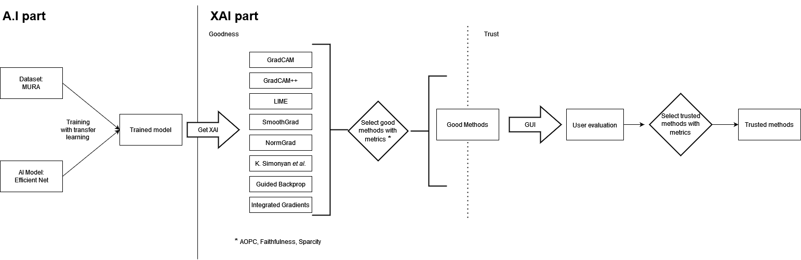
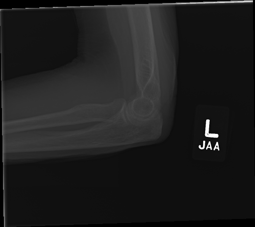
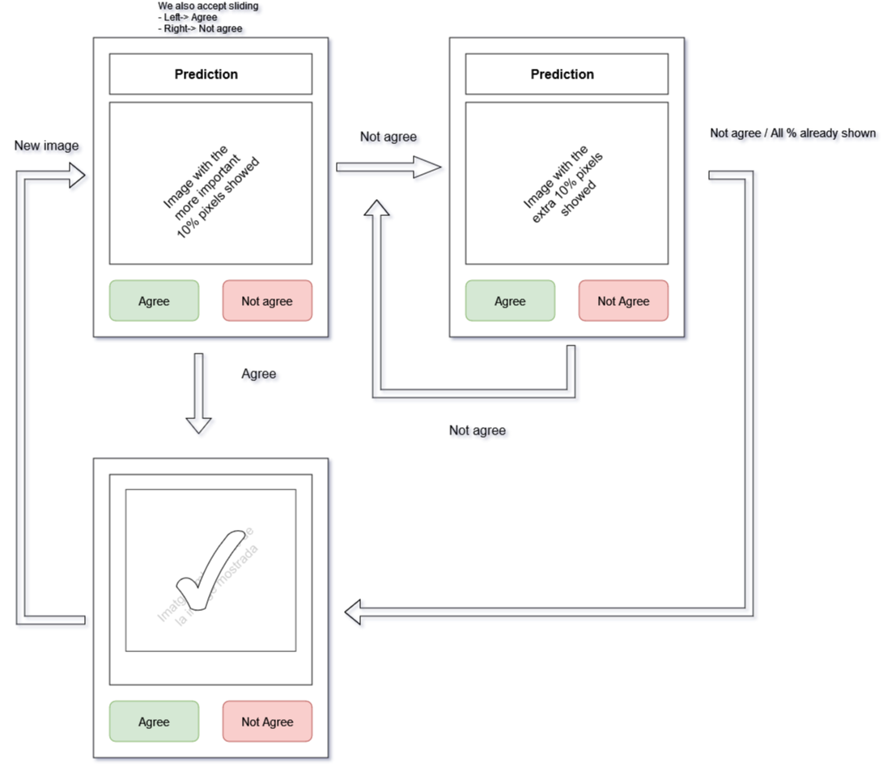

# XAI experiment

We developed a two parts experiment aiming to measure the performance of XAI methods in the medical image context. To do so, we assessed the performance, dividing it into two different elements: goodness and trust. The experiment is divided also into two parts, each one of them aimed to measure these two elements separately. Nonetheless, we also had two elements shared between both of the parts: the dataset and the artificial intelligence model.

 

	
	 
	<em>Diagram of the proposed experiment</em>

 

## Shared elements

### Dataset

For the experiment, we used the [MURA](https://stanfordmlgroup.github.io/competitions/mura/) dataset. This dataset contains x-ray images from seven parts of the upper body. The original goal for the dataset was the detection of bone fractures. Nonetheless, we simplified the problem, trying to discover the part of the body found on the image. To simplify even further the problem, we converted the classification problem into a binary one between hands and elbows.

	

		
		
	

	 
	<em>Examples of hands and elbows from the MURA dataset</em>

The dataset contains multiples view of each body part. We are going to use all of these views indistinctly. 

##### Specifications

|  Information		| Values            	|
| :---------------	|:--------------------:	|
| Dataset size		| 11077					|
| Train size	 	| 10188					|
| Test size	 		| 889					|
| Number of classes	| 7						|
| Selected classes	| Hands and elbows		|
| Type of image 	| X-ray					|
| Size of image 	| Variable				|
| Representation	| UINT8					|

### A.I model

The A.I model is a crucial part in the process of obtaining explanations. Nonetheless, we considered an issue outside the scope of the research, and we were only interested in obtaining a model with an acceptable performance that allowed us to apply successfully XAI techniques. To be able to accomplish this, we took into consideration the access to an already existing implementation and the performance in the benchmark competition [ImageNet](https://paperswithcode.com/sota/image-classification-on-imagenet?tag_filter=18%2C17%2C5%2C3). We selected the CNN [EfficientNet](https://arxiv.org/pdf/1905.11946.pdf), due to the availability of an already implemented version of it and the high score in the ImageNet benchmark competition. We increased the performance of this model with the usage of *transfer learning* based on the weights obtained to train with the ImageNet dataset.  

## Goodness

The first part of the experiment is the assessment of the goodness of the XAI algorithms used. Goodness is defined by Hoffman *et al.* as

> \[...\] we find assertions about what makes for a good explanation, from the standpoint of statements as explanations. There is a consensus on this; factors such as clarity and precision. Thus, one can look at a given explanation and make an a priori (or decontextualized) judgment whether it is "good."

In other words, the goal of this part of the experiment was to assure, with the measure of the goodness, the quality of the methods to obtain saliency map and if the results of these methods were consequent with the learned relations of the AI model. 

To measure the goodness, multiple metrics had been proposed. Following the guidelines of T. Gomez *et al.* we used one metric for goodness (**AOPC**, proposed by Samek *et al.*) and two auxiliary ones (**Sparsity**, proposed by T. Gomez *et al.* and **Faithfulness**, proposed by D. Alvarez *et al.*) to overcome the limitations of the first one. We also studied the option to aggregate them into an easier to interpret metric. 

The results of the goodness were used to select the best fitting XAI method from the ones indicated in the next subsection.

### XAI Methods

In this experiment, we were only taken into consideration the XAI algorithms that generates saliency maps. As we already explained, the Goodness will be used to select which saliency algorithm to use for the follow-up experimentation. The selection of the algorithms to calculate the goodness is obtained from two sources: Miro *et al.* (SLR) and from Hooker *et al.*

	
|  Methods		   		|	Authors															|
| :-------------------  | :------------------------------------------------------------ 	|
| GradCAM	   			| [S. Ramprasaath *et al.*](https://arxiv.org/abs/1610.02391)		|
| GradCAM++	   			| [A. Chattopadhyay *et al.*](https://arxiv.org/abs/1710.11063)		|
| LIME					| [M. Ribeiro *et al.*](https://arxiv.org/abs/1602.04938)			|
| SmoothGrad			| [D. Smilkov *et al.*](https://arxiv.org/abs/1706.03825)			|
| K. Simonyan *et al.*	| [K. Simonyan *et al.*](https://arxiv.org/abs/1312.6034)			| 	
| Guided Backprop 		| [J. Springenberg *et al.*](https://arxiv.org/abs/1412.6806)		|
| Integrated Gradients	| [M. Sundararajan *et al.*](https://arxiv.org/abs/1703.01365)		|

Similarly, that we did with the AI model we used already implemented version of these different XAI methods.

The results of this part of the experiment were a set of acceptable XAI methods for the selected dataset, MURA, and the selected black-box model, EfficientNet. The assertion of this acceptability will be the goodness defined in the previous section. 

## Trust

The second part of the experiment aims to assess the trust of the users in the explainability.

Once we checked the Goodness of a XAI method, our goal is to evaluate the trust of the user with the XAI algorithms. Previous works proposed to evaluate the explanation in intelligent systems with different multidimensional scales (Adams, *et al.*; Montague (2010)). These scales are hard to analyze, compare and evaluate. For these reasons, we proposed the usage of easier to interpret evaluation techniques.

To measure the trust of the user with the previously defined XAI method, we used two elements: a graphical user interface (GUI) and a new standard metric *Trust F1-Score*.

### GUI

We defined a GUI aiming to show to the user the explanation and result obtained from the methods and to obtain the level of trust. This GUI is defined to be used with images and their respective saliency map. Instead of showing the saliency map as an explanation, we use it to generate an image with only the more important pixels. We think that this visualization is simpler to understand for a non-expert user. Furthermore, one of the main features of the GUI is that the user has the ability to increase the number of pixels to be shown. This ability gave the possibility to analyze from which percentage of pixels the user trust the explanation. This interface is sketched in the next figure:

	

		
	

	 
	<em>Proposed GUI to evaluate the trust of the user</em>

From the GUI we obtained two kinds of data: implicit data, that we obtained from the context and without directly asking the user and explicit data, mainly whether the user trust the prediction, the percentage of pixels needed to trust it and user information as the gender, age and ocupation. 

### Data collection and analysis
#### Implicit data
* [NYT Library](https://github.com/nytimes/react-tracking)
* [Google Scholar + React](https://www.freecodecamp.org/news/performance-and-user-tracking-in-react-with-google-analytics/)

The main goal to collect implicit data was to be able to analyze the behavior of the user and to check if these data impacts the goals of the application. 

The first step was to build a dataset with enough data to be suitable for machine learning algorithms. In this new dataset we had included the previously discussed explicit data with multiple implicit information, mainly we record all interactions with the interface and sensor information, as gyroscope and accelerometer. And finally, if the user was able to identify correctly if the image and prediction were related or not. Furthermore, from the previous data we develop secondary features:

* __Time to the first iteration with the GUI__. We aimed to measure the time that the user need to understand the initial visualization. 
* __Hesitation between answers.__ We aimed to analyze if the user hesitated to select one of the options of the GUI as a proxy measure for the trust.

The next step once the data was obtained was the training of a white-box machine learning algorithm to be able to identify unknown relations within the recollected data.

#### Explicit data

We collected three kinds of explicit data:

* Personal data: gender, study level, age and profession.
* If the user considers that the image and the prediction were correctly related.
* Percentage of the image showed to the user.

These three information were used in different ways. The first one, the personal data, was used to verify whether the personal context of the user affect the performance of the task. The other two information were used to calculate a set of metrics.

### Trust metrics

On the previous sections, we defined the data that we used to calculate the metrics. 

**TO DO**