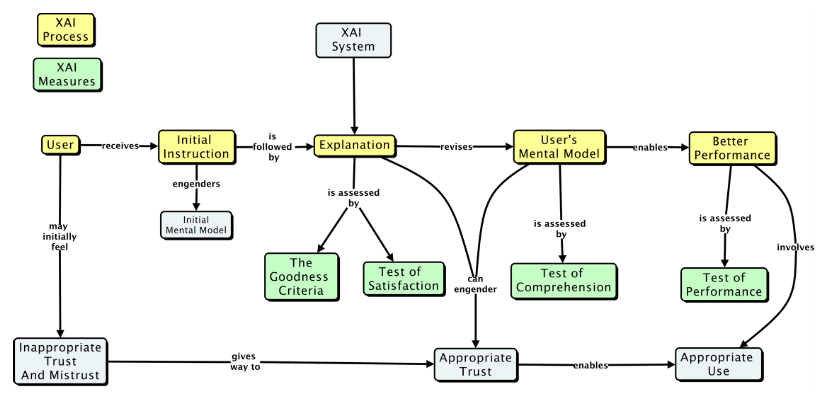
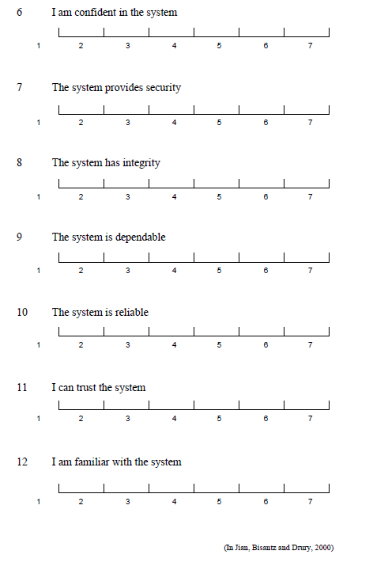
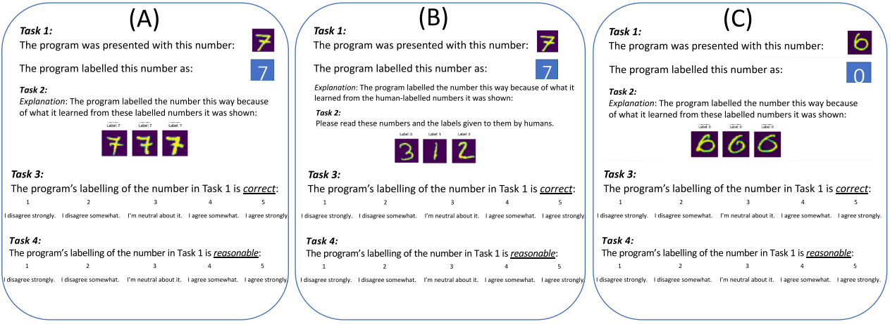
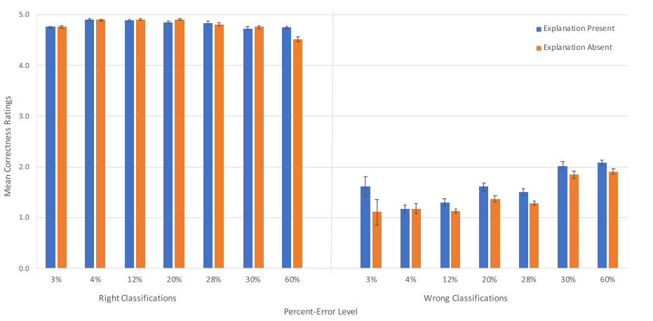
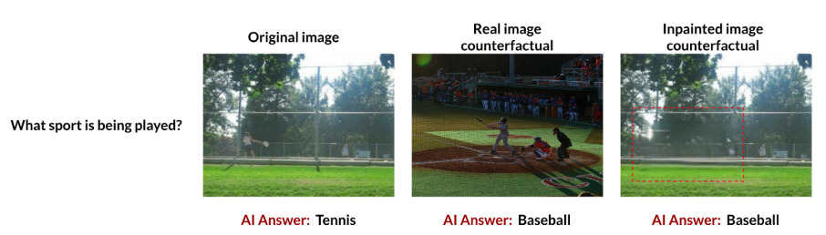

# Mètriques per saliència

 

	
	 
	<em>Model de XAI extret de Hoffman <i>et al.</i></em>

 

## *Goodness*
#### Saliency checks for saliency metrics [(R. Tomsett *et al.* 2020)](https://aaai.org/ojs/index.php/AAAI/article/view/6064)

-	**Towards Robust Interpretability with Self-Explaining Neural Networks** [Alvarez *et al.* (2018)](http://arxiv.org/abs/1806.07538)
	
	Creen conceptes amb un autoencoder, similar a *tcav*. Els conceptes s'expliquen mitjançant *prototypes* (exemples). Valoren tres elements diferents:

	- (i) *Explicitness/Intelligibility: Are the explanations immediate and understandable?*
			**Qualitatiu**: Subjectivament si l'explicació és immediata. 
	- (ii) *Faithfulness: Are relevance scores indicative of "true" importance?* 
			**Quantitatiu**: És un mètode objectiu que es calcula $t.q.$ la F(x) = a la correlació de Pearson entre la importància donada pel mètode de saliència i com la pertorbació d'aquella features (píxel en el cas de CNN i saliència) afecta la classificació.
	- (iii) *Stability: How consistent are the explanations for similar/neighboring examples?*
			**Quantitatiu**: Indica si l'explicació és consistent a petites pertorbacions de l'entrada.

-	[Evaluating the visualization of what a deep neural network has learned](https://ieeexplore.ieee.org/document/7552539/)
	
	Detecten que la qualitat dels mapes de saliència no és avaluada objectivament i ho pretenen resoldre introduint un *framework* amb aquesta finalitat. Defineixen l'AOPC, una mètrica consistent en eliminar les àrees més importants, segons el mapa de saliència, i observar com canvia el resultat del model. Després es calcula l'àrea davall la corba que defineix, en el gràfic RES-NPerturbació, la pertorbació iterativa de l'entrada.
	
-	[A benchmark for interpretability methods in deep neural networks](http://arxiv.org/abs/1806.10758)

	**ROAR, RemOve And Retrain.** Modifiquen el dataset (tant entranment com validació) a partir de la saliència i tornen a entrenar el model. Així poden assegurar-se que la pèrdua de qualitat en les classificacions no és causada per modificar les imatges per se sinó per la correcta selecció dels píxels de qualitat: 

	> A commonly used strategy is to remove the supposedly informative features from the input and look at how the classifier degrades. This method is cheap to evaluate but comes at a significant drawback. Samples where a subset of the features are removed come from a different distribution (as can be seen in Fig. 1). Therefore, this approach clearly violates one of the key assumptions in machine learning: the training and evaluation data come from the same distribution. Without re-training,it is unclear whether the degradation in model performance comes from the distribution shift or because the features that were removed are truly informative.

	**Guided Backprop, Integrated Gradients, Gradients or Sensitivity heatmaps** funcionen igual de malament que valors aleatoris.

	Els resultats que s'esperen és que si eliminam els píxels amb major saliència hauríem de tenir una menor acuracy del test-set.

Tant l'article de saliency metrics, com aquests tres articles, tenen en comú que no són mètriques de la qualitat de l'explicabilitat, sinó de la seva fiabilitat, és a dir, comproven que realment el mapa de saliència sigui cert. **Emprar aquestes mètriques com a priori de qualsevol experiment**.

## *Trust*
#### Metrics for Explainable AI: Challenges and Prospects [R. Hoffman *et al.*](http://arxiv.org/abs/1812.04608)

Analitzen diferents aspectes psicològics de l'explicabilitat i com mesurar-los:

-	**Bonesa (*Goodness*)**. És l'explicació clara i precisa. Per mesurar-ho presententen una checklist.
-	**Satisfacció (*Satisfaction*)**. L'explicació és satisfactòria per l'usuari en el seu context. És descrita com el grau amb el qual l'usuari considera que entén el sistema d'IA explicat a ell. 
-	**Curiositat (*Curiosity*)**- La cerca de l'explicació està induïda per la curiositat, per tant, la manca d'aquesta fa que l'explicació sigui manco útil. Checklist
-	**Confiançan (*Trust*)**. Dues preguntes formen part d'aquesta confiança: et dona confiança? Seguiries la recomanació del sistema? Scales:
	-	**Cahour-Forzy (2009), [Adams, et al. (2003)](https://cradpdf.drdc-rddc.gc.ca/PDFS/unc17/p520342.pdf)**. 
	-	**Montague (2010)**. Aplicat a eines per la diagnosi de malalties. 
	-	**Jian, et al.**
	-	**Madsen-Gregor Scale**. La confiança es defineix amb cinc factors: *reliability, technical competence, understanbility, faith, personal attachment*.
	- 	**Merrit**. Similar a Cahour-Forzy.

[**Adams, et al.**](https://cradpdf.drdc-rddc.gc.ca/PDFS/unc13/p520342.pdf). Pàgina 31 - Annex A (pàg. 124)

> The scale assumes that the participant has had considerable experience using the XAI system. Hence, these questions would be appropriate for scaling after a period of use, rather than immediately after an explanation has been given and prior to use experience. In the original scale, the items are rated on a bipolar scale going from "I agree completely" to "I do not agree at all."*

	
	

## Interfícies i disseny d'experiments

#### Explaining black-box classifiers using post-hoc explanations-by-example: The effect of explanations and error-rates in XAI user studies [E. Kenny *et al.*](https://doi.org/10.1016/j.artint.2021.103459)
##### Preprint: Play MNIST for me! user studies on the effects of post-hoc, example-based explanations & error rates on debugging a deep learning, black-box classifier [(C. Ford *et al.*)](https://arxiv.org/ftp/arxiv/papers/2009/2009.06349.pdf)

Duen a terme dos experiments per analitzar l'explicació obtinguda d'un algoritme XAI d'explicació per exemple (vegeu figura següent). L'explicació tant pot ser present (A i B) com absent (C). Aquest fet és tingut en compte per l'obtenció dels resultats.

 

	

 

Els seus tres experiments els duen a terme amb 348 participants. **Detecten respostes aleatòries dels participants (aquells participants que no detecten errors de classificació detectats per tota la resta)**. En els tres experiments l'usuari, mitjançant escales i *checklists* qualifica els següents ítems de la classificació i l'explicació: *correctness, reasonableness, global correctness & reasonableness* i *trust and satisfaction*. Realitzen anàlis MANOVA.

El primer experiment analitza com es relacionen la presència o no d'explicació, la qualitat de la predicció amb els ítems analitzar. Demostren que la presència d'explicacions només es necessari per justificar les prediccions incorrectes, com es pot veure en la figura següent.

 

	

 

El segon experiment consisteix a observar com afecten ràtio d'error alts en la classificació per la valoració de les prediccions correctes. Per això comparen els ítems a analitzar amb diferents nivells d'errors mostrat a l'usuari. 

*In summary, trust is mainly impacted by the error-rates people encounter rather than the provision of an explanation. The explanation seems to act at an item-level, affecting people's perception of the correctness of misclassifications, but those explanations do not “explain away” the perception of those failures at the system-level. Trust is impacted by rising error-rates, though not linearly; from this study, it appears that trust levels decrease sharply at 30%-errors (relative to 3%-errors) and then stay around this level for 60%-errors.*

 

	

 

El tercer experiment serveix per calcular la confiança no amb una de les prediccions sinó del model en conjunt. Per fer-ho afegeixen dues avaluacions per part de l'usuari, abans i després d'executar un dels experiments previs, a on es demana avaluar el model en conjunt.

#### Improving users' mental model with attention‐directed counterfactual edits [K. Alipour *et al.*](https://onlinelibrary.wiley.com/doi/10.1002/ail2.47)

Realitzen experiments de XAI respecte a un sistema d'imatge-pregunta (*image-question (IQ)*). El seu objectiu és:

> \[...\] examine the effect of exposing the users to explanatory examples where the inputs are changed in a controlled manner in order to better observe how the machine output changes to controlled changes in the input. We call these controlled changes in input, “counterfactuals.”*

Aquest article es caracteritza per no demanar de manera explícita preguntes a l'usuari sobre la qualitat, sinó estudiar com afecta la visualització d'explicacions per dur a terme tasques amb les imatges. 

Duen a terme dos tipus de contraexemple: un contraexemple obtingut amb GANs i un altre obtingut mitjançant tècniques de CBR (similar a E. Kenny *et al.*). Vegeu la següent figura com un exemple dels dos casos amb l'exemple original.

 

	

 

Defineixen dos experiments diferents. El primer experiment consisteix a mostrar una imatge amb la seva respectiva classificació, posteriorment mostrar una imatge modificada o no, i demanar a l'usuari si creu que el model farà una predicció diferent. 

## Conclusions

El primer conjunt de mètriques no són el que ens interessen: indiquen si l'algoritme és correcte, però no si una persona hi confiaria (són mètriques de XAI però no d'explicació). El segon conjunt d'eines serveixen per avaluar la confiança. Tots els mètodes es basen en escales i sistemes complexes. El resultat no és simple d'interpretar. 