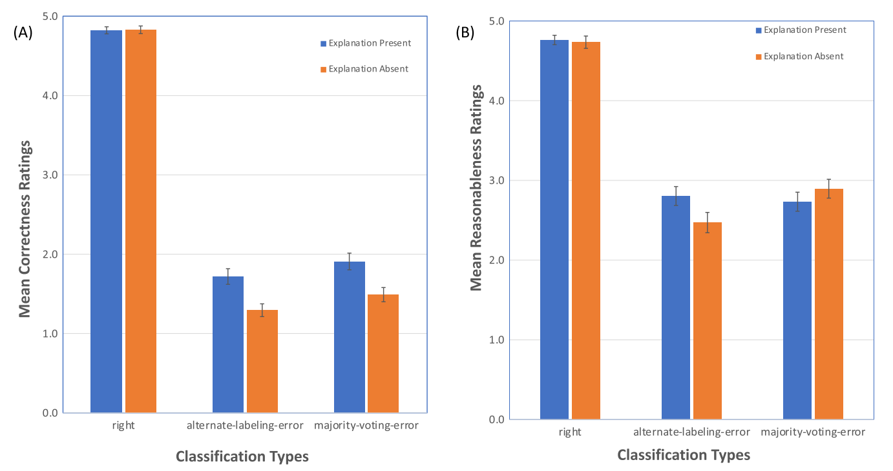

# Mètriques per saliència

## Índex

|  Article        | Autors           | Any    | Categoria  |
| :-------------- |:-----------------| :-----:| :--------- |
| Sanity Checks for Saliency Metrics      								| [R. Tomsett *et al.*](https://aaai.org/ojs/index.php/AAAI/article/view/6064) | 2020 | *-* |
| Towards Robust Interpretability with Self-Explaining Neural Networks      | [D. Alvarez *et al.*](http://arxiv.org/abs/1806.07538)    |   2018 | *Goodness* |
| Evaluating the visualization of what a deep neural network has learned 	| [W. Samek *et al.*](https://ieeexplore.ieee.org/document/7552539/) | 2017 | *Goodness* |
| A benchmark for interpretability methods in deep neural networks			| [S. Hooker *et al.*](http://arxiv.org/abs/1806.10758) 	| 2018 	| *Goodness* |
| RisE: Randomized input sampling for explanation of black-box models 		| [V. Petsiuk *et al.*](http://arxiv.org/abs/1806.07421)	| 2018	| *Goodness* |
| Metrics for saliency map evaluation of deep learning explanation methods	| [T. Gomez *et al.*](http://arxiv.org/abs/1806.10758)		| 2020	| *Goodness* |
| Metrics for Explainable AI: Challenges and Prospects						| [R. Hoffman *et al.*](http://arxiv.org/abs/1812.04608)	| 2019	| *Trust* 	 |
| Trust in automated systems literature review				| [Adams, *et al.*](https://cradpdf.drdc-rddc.gc.ca/PDFS/unc13/p520342.pdf)	| 2003	| *Trust* 	 |
| Explaining black-box classifiers using post-hoc explanations-by-example: The effect of explanations and error-rates in XAI user studies						| [E. Kenny *et al.*](https://www.sciencedirect.com/science/article/pii/S0004370221000102?via%3Dihub)	| 2021	| Experiments	 |
| Improving users’ mental model with attention‐directed counterfactual edits						| [K. Alipour *et al.*](https://onlinelibrary.wiley.com/doi/10.1002/ail2.47)	| 2021	| Experiments 	 |
| Generating and Evaluating Explanations of Attended and Error-Inducing Input Regions for VQA Models | [A. Ray *et al.*](http://dx.doi.org/10.22541/au.162464902.28050142/v1)	| 2021	| Experiments 	 |

 

	
	 
	<em>Model de XAI extret de Hoffman <i>et al.</i></em>

 

### Mètriques

|  Mètrica        						| Autors            	| Descripció	| Tipus		|
| :------------------------------------	|:-------------------- 	|:------------	|:---------	|
| *Faithfulness*						| D. Alvarez *et al.*	| Correlació de pearson entre el mapa de saliència i la baixada de l'*score* per la tasca a realitzar quan es perturba un píxel				   											| *Goodness*   |
| *AOPC*								| W. Samek *et al.*		| Càlcul de l'àrea davall la corba definida per la baixada de l'*score* a causa de perturbar els píxels (amb valor igual a 0) amb l'ordre indicat per la saliència						 | *Goodness* 	| 
| *Deletion Area Under Curve (DAUC)*	| V. Petsiuk *et al.*	| Càlcul de l'àrea davall la corba definida per la baixada de l'*score* a causa de perturbar els píxels (desenfocant l'imatge) amb l'ordre indicat per la saliència						 |*Goodness*	|
| *Integration Area Under Curve (IAUC)*	| V. Petsiuk *et al.*	| Càlcul de l'àrea davall la corba definida per l'increment de l'*score* a causa d'anar afegint la informació dels píxels amb l'ordre invers indicat per la saliència			    |*Goodness*	   |
| *Sparcity*							| T. Gomez *et al.*		| Comprova si la saliència està focalitzada a un punt o per altra part està dispersa per tota la imatge ( a més agrupada millor )     										  			  |*Goodness*	 |
| *Calibration rate*					| T. Gomez *et al.*		| Similar a DAUC i a IAUC fan les mateixes modificacions però enlloc de calcular l'àrea calculen la correlació entre els píxels														|*Goodness*	   |
| *Helpfulness*							| A. Ray *et al.*		| Compara mitjançant un *z-test* si els mapes d'error i els mapes de saliència són o no iguals																							  |*Goodness*	 |

Les mètriques AOPC, DAUC i IAUC són pràcticament la mateixa amb molt poques diferències. De la mateixa manera *Fatihfulness* i *Calibration rate* semblen ser la mateixa.

## *Goodness*

### Saliency checks for saliency metrics [(R. Tomsett *et al.* 2020)](https://aaai.org/ojs/index.php/AAAI/article/view/6064)

Els autors analitzen la fiabilitat (*reliability*) d'un conjunt de mètriques per mapes de saliència, és a dir, si els resultats són consistents.

> While a reliable metric is not necessarily valid, a valid metric must be reliable (Davidshofer and Murphy 2005)

La fiabilitat és estimada amb tres ítems diferents:

-	*__Inter-rater reliability__*. Consistència del mapa de saliència entre diferents imatges. *In other words, does the metric consistently rank some saliency methods higher than others over all the images?*. Per mesurar aquesta característica empren l'estadístic de Krippendorf. 
	

	

	

	a on D_o és la diferència entre imatges i D_e és l'esperat per motius aleatoris. 

- *__Inter-method reliability__*. Comprova si la mètrica és similar a diferents mètodes de saliència. Això es pot mesurar mitjançant el càlcul de la correlació entre les saliències calculades per imatges amb diferents mètodes.
	
  > Inter-method reliability assesses whether a saliency metric agrees across different saliency methods. This can be mea- sured by taking the pairwise correlations between the scores of the different saliency methods on the data set images. If the scores of each saliency method fluctuate similarly be- tween images, these correlations will be high, indicating high inter-method reliability.

- *__Internal consistency reliability__*. Indica si diferents mètriques de saliència analitzen el mateix element. Això es pot mesurar calculant la correlació entre diferents mètriques.

Mesuren aquests tres ítems per dues mètriques, les introduïdes per D. Alvarez *et al.* i per W. Samek *et al.*. Els resultats mostren que **no compleixen cap dels tres requisits**. Per aquest motiu es pot seguir investigant sobre mètriques de bonessa per mapes de saliència.

### Towards Robust Interpretability with Self-Explaining Neural Networks [(D. Alvarez *et al.* (2018))](http://arxiv.org/abs/1806.07538)
	
Creen conceptes amb un autoencoder, similar a *tcav*. Els conceptes s'expliquen mitjançant *prototypes* (exemples). Valoren tres elements diferents:

- (i) *Explicitness/Intelligibility: Are the explanations immediate and understandable?*
		**Qualitatiu**: Subjectivament si l'explicació és immediata. 
- (ii) *Faithfulness: Are relevance scores indicative of "true" importance?* 
		**Quantitatiu**: És un mètode objectiu que es calcula tal que la F(x) = a la correlació de Pearson entre la importància donada pel mètode de saliència i com la pertorbació d'aquella features (píxel en el cas de CNN i saliència) afecta la classificació.
- (iii) *Stability: How consistent are the explanations for similar/neighboring examples?*
		**Quantitatiu**: Indica si l'explicació és consistent a petites pertorbacions de l'entrada.

### Evaluating the visualization of what a deep neural network has learned ([W. Samek *et al.*](https://ieeexplore.ieee.org/document/7552539/))
	
Detecten que la qualitat dels mapes de saliència no és avaluada objectivament i ho pretenen resoldre introduint un *framework* amb aquesta finalitat. Defineixen l'AOPC, una mètrica consistent en eliminar les àrees més importants, segons el mapa de saliència, i observar com canvia el resultat del model. Després es calcula l'àrea davall la corba que defineix, en el gràfic RES-NPerturbació, la pertorbació iterativa de l'entrada.
	
### A benchmark for interpretability methods in deep neural networks ([S. Hooker *et al.*](http://arxiv.org/abs/1806.10758))

Els autors defineixen un *framework* per l'obtenció d'explicacions: **ROAR, RemOve And Retrain**. Aquest *framework* consisteix en pertorbar el *dataset* (tant el d'entranment com el de validació) a partir de la saliència i tornen a entrenar el model. Així poden assegurar-se que la pèrdua de qualitat en les classificacions no és causada per modificar les imatges *per se* sinó per la correcta selecció dels píxels de qualitat: 

> A commonly used strategy is to remove the supposedly informative features from the input and look at how the classifier degrades. This method is cheap to evaluate but comes at a significant drawback. Samples where a subset of the features are removed come from a different distribution (as can be seen in Fig. 1). Therefore, this approach clearly violates one of the key assumptions in machine learning: the training and evaluation data come from the same distribution. Without re-training,it is unclear whether the degradation in model performance comes from the distribution shift or because the features that were removed are truly informative.

**Guided Backprop, Integrated Gradients, Gradients or Sensitivity heatmaps** funcionen igual de malament que valors aleatoris.

Els resultats que s'esperen és que si eliminam els píxels amb major saliència hauríem de tenir una menor acuracy del test-set.

### RisE: Randomized input sampling for explanation of black-box models ([V. Petsiuk *et al.*](http://arxiv.org/abs/1806.07421))

Els autors d'aquest article proposen un mètode d'explicabilitat: RISE (apareix a l'SLR). Una vegada proposat defineixen un conjunt d'experiments per comprovar la qualitat del mapa de saliència. Defineixen dues mètriques. El seu objectiu és obtenir mètriques objectives sense que l'usuari formi part de la seva avaluació. Proposen dues mètriques:

- 	*__Deletion Area Under Curve (DAUC)__*. Elimina successius píxels de més a menor importància i defineix una corba amb aquesta operació. Finalment fa l'integral de l'àrea davall aquesta corba.
-	*__Integration Area Under Curve (IAUC)__*. Inversa que l'anterior parteix des d'una imatge completament modificada i va recuperant els valors original amb ordre. De la mateixa manera defineix una corba i calcula la integral.  

A part d'aquestes dues mètriques defineix el que anomena *Pointing game* a on es comparen els mapes de saliència amb un *ground truth* definid per humans. Es considera que un píxel és correcte si està dins la *bounding box* definida en el GT i incorrecte sinó. Es calcula la proporció de correctes respecte el total.

### Metrics for saliency map evaluation of deep learning explanation methods ([T. Gomez *et al.*](http://arxiv.org/abs/1806.10758))

Els autors d'aquest article observen que la majoria de les mètriques per la bonessa dels mapes de saliència es basen en la modificació de l'entrada seguint el que indica la saliència. Analitzen dues mètriques basades en això: *Deletion Area Under Curve (DAUC)* i *Integration Area Under Curve (IAUC)*. Partint d'aquest anàlisi observen que aquestes mètriques no són vàlides ja que les modificacions de la imatge provoca que siguin de diferents dominis.

> Indeed, the kind of distortions produced by the masking/blurring operations do not exist naturally in the dataset and are different from the kind produced by the standard data augmentations like random crop, horizontal flip, and color jitter, meaning that the model has not learned to process images with such distortions. Therefore, the distribution of the images presented to the model is different from the one met during training. However, it has been documented that CNNs and more generally deep learning models have poor generalization outside of the training distribution [9]. This shows that DAUC and IAUC may not reflect the faithfulness of explanation methods as they are based on a behavior of the model that is different from that encountered when facing training distribution (e.g. during the test phase).

A més de la limitació anterior també s'observa que les mètriques existents no tenen en compte el valor absolut de la saliència sinó només el seu ordre. Per resoldre aquestes limitacions proposen tot un conjunt de mètriques **complementàries** (no tenen sentit tampoc per elles mateixes):

-	*__Sparcity__*. Un mapa de saliència és menys espars si la zona mostrada està més concentrada en un menor nombre de píxels. 

	

	

	

-	*__Calibration__*. Una mapa de saliència està calibrat quan els valors dels píxels únicament contenen informació de la importància d'aquests píxels per la classificació. Proposen dues mètriques similars a les vistes, que modifiquen l'entrada i després realitzen la correlació entre la saliència i els valors de la classificació de la imatge modificada. El propi article indica que aquestes mètriques també provoquen imatges fora del domini.

**No es poden emprar aquestes mètriques separades.**

## *Trust*
### Metrics for Explainable AI: Challenges and Prospects ([R. Hoffman *et al.*](http://arxiv.org/abs/1812.04608))

Analitzen diferents aspectes psicològics de l'explicabilitat i com mesurar-los:

-	**Bonesa (*Goodness*)**. És l'explicació clara i precisa. Per mesurar-ho presententen una checklist.
-	**Satisfacció (*Satisfaction*)**. L'explicació és satisfactòria per l'usuari en el seu context. És descrita com el grau amb el qual l'usuari considera que entén el sistema d'IA explicat a ell. 
-	**Curiositat (*Curiosity*)**. La cerca de l'explicació està induïda per la curiositat, per tant, la manca d'aquesta fa que l'explicació sigui manco útil. Checklist
-	**Confiançan (*Trust*)**. Dues preguntes formen part d'aquesta confiança: et dona confiança? Seguiries la recomanació del sistema? Scales:
	-	**Cahour-Forzy (2009), [Adams, et al. (2003)](https://cradpdf.drdc-rddc.gc.ca/PDFS/unc17/p520342.pdf)**. 
	-	**Montague (2010)**. Aplicat a eines per la diagnosi de malalties. 
	-	**Jian, et al.**
	-	**Madsen-Gregor Scale**. La confiança es defineix amb cinc factors: *reliability, technical competence, understanbility, faith, personal attachment*.
	- 	**Merrit**. Similar a Cahour-Forzy.

### Trust in automated systems literature review ([Adams, *et al.*](https://cradpdf.drdc-rddc.gc.ca/PDFS/unc13/p520342.pdf))
 
Estat de l'art sobre la confiança amb sistemes automàtics. L'important es que proposen una escala pel càlcul de la confiança.

> The scale assumes that the participant has had considerable experience using the XAI system. Hence, these questions would be appropriate for scaling after a period of use, rather than immediately after an explanation has been given and prior to use experience. In the original scale, the items are rated on a bipolar scale going from "I agree completely" to "I do not agree at all." Pàgina 31 - Annex A (pàg. 124)

	
	

## Interfícies i disseny d'experiments

### Explaining black-box classifiers using post-hoc explanations-by-example: The effect of explanations and error-rates in XAI user studies ([E. Kenny *et al.*](https://doi.org/10.1016/j.artint.2021.103459))
#### Preprint: Play MNIST for me! user studies on the effects of post-hoc, example-based explanations & error rates on debugging a deep learning, black-box classifier [(C. Ford *et al.*)](https://arxiv.org/ftp/arxiv/papers/2009/2009.06349.pdf)

Duen a terme dos experiments per analitzar l'explicació obtinguda d'un algoritme XAI d'explicació per exemple (vegeu figura següent). L'explicació tant pot ser present (A i B) com absent (C). Aquest fet és tingut en compte per l'obtenció dels resultats.

 

	

 

Els seus tres experiments els duen a terme amb 348 participants. **Detecten respostes aleatòries dels participants (aquells participants que no detecten errors de classificació detectats per tota la resta)**. En els tres experiments l'usuari, mitjançant escales i *checklists* qualifica els següents ítems de la classificació i l'explicació: *correctness, reasonableness, global correctness & reasonableness* i *trust and satisfaction*. Realitzen anàlis MANOVA.

El primer experiment analitza com es relacionen la presència o no d'explicació, la qualitat de la predicció amb els ítems analitzar. Demostren que la presència d'explicacions només es necessari per justificar les prediccions incorrectes, com es pot veure en la figura següent.

 

	

 

El segon experiment consisteix a observar com afecten ràtio d'error alts en la classificació per la valoració de les prediccions correctes. Per això comparen els ítems a analitzar amb diferents nivells d'errors mostrat a l'usuari. 

> \[...\] trust is mainly impacted by the error-rates people encounter rather than the provision of an explanation. The explanation seems to act at an item-level, affecting people's perception of the correctness of misclassifications, but those explanations do not “explain away” the perception of those failures at the system-level. Trust is impacted by rising error-rates, though not linearly; from this study, it appears that trust levels decrease sharply at 30%-errors (relative to 3%-errors) and then stay around this level for 60%-errors.

 

	

 

El tercer experiment serveix per calcular la confiança no amb una de les prediccions sinó del model en conjunt. Per fer-ho afegeixen dues avaluacions per part de l'usuari, abans i després d'executar un dels experiments previs, a on es demana avaluar el model en conjunt.

### Improving users' mental model with attention‐directed counterfactual edits ([K. Alipour *et al.*](https://onlinelibrary.wiley.com/doi/10.1002/ail2.47))

Realitzen experiments de XAI respecte a un sistema d'imatge-pregunta (*image-question (IQ)*). El seu objectiu és:

> \[...\] examine the effect of exposing the users to explanatory examples where the inputs are changed in a controlled manner in order to better observe how the machine output changes to controlled changes in the input. We call these controlled changes in input, “counterfactuals.”*

Aquest article es caracteritza per no demanar de manera explícita preguntes a l'usuari sobre la qualitat, sinó estudiar com afecta la visualització d'explicacions per dur a terme tasques amb les imatges. 

Duen a terme dos tipus de contraexemple: un contraexemple obtingut amb GANs i un altre obtingut mitjançant tècniques de CBR (similar a E. Kenny *et al.*). Vegeu la següent figura com un exemple dels dos casos amb l'exemple original.

 

	

 

Defineixen dos experiments diferents. El primer experiment consisteix a mostrar una imatge amb la seva respectiva classificació, posteriorment mostrar una imatge modificada o no, i demanar a l'usuari si creu que el model farà una predicció diferent a la inicial. El segon experiment consisteix en mostrar a l'usuari un conjunt d'exemple a l'usuari, amb combinació a explicacions contrafactuals o no, i observar com afecta a capcitat de predir per part de l'usuari el resultat del model d'AI en la tasca a realitzar

 

	
	 
	<em>Exemple del segons experiment de K. Alipour et al.</em>

 

Els resultats del primer experiment permeten observar com l'exposició d'exemple contrafactuals millora significativament la capacitat de l'usuari de prediure si el model realitzarà la tasca correctament, és a dir, permet millorar el model mental de l'usuari. Els resultats del segons experiment són totalment compatibles amb els obtinguts en el primer experiment. Així s'observa que la presència d'exemples contrafactuals millora la capacitat de l'usuari de respondre la pregunta que preten resoldre el model imatge-pregunta.

### Generating and Evaluating Explanations of Attended and Error-Inducing Input Regions for VQA Models ([A. Ray *et al.*](http://dx.doi.org/10.22541/au.162464902.28050142/v1))

Defineixen un tipus especial de saliència anomenat *Errors-maps*. Aquests mapes de saliència permeten saber quina zona és la que pot provocar que el model faci la tasca malament. Això ho fan per la poca utilitat dels mapes de saliència actuals. 

> Users get mislead by current attention maps We observe that the users’ accuracy in predicting correctness does not improve over not seeing any attention maps. In fact, we see a slight decrease (57.18% without explanations, 56.87% when seeing attention maps). This suggests that the guessing accuracy in either case (with or without attention maps) is close to random guessing (50%).

Els mapes d'error, en combinació dels mapes d'atenció (mapes de saliència típics). Permeten comprovar si el model es correcte o no.

 

	

 

Creen una nova mètrica *helpfulness*, aquesta mètrica considera un model d'explicabilitat millor si la rellavança del mètode es major quan el model d'IA és correcte que quan és incorrecte. En el cas dels mapa d'error és el contrari: la rellavança hauria de ser major quan el model d'IA és incorrecte. La rellavança es calculada comparant el mapa de saliència amb mapes d'atenció extret d'usuaris.

#### Experiment

L'experimentació duita a terme té dues parts diferents. Una primera que amb la mètrica *helpfulness* compara diferents algoritmes d'obtenció de mapes de saliència. I una segona part que consisteix en mostrar a usuaris parelles imatge-pregunta i demanar que intentin resoldre la pregunta. Els usuaris es divideixen en subgrups depenent de si observen, a la vegada que la imatge i la pregunta, un mapa d'error. Empren l'*accuracy* dels usuaris com a mètrica. Els resultats indiquen que la presència d'explicació millora la *performance* dels usuaris.

## Conclusions

Els articles analitzats es poden dividir en quatre grups depenent del motiu de la inserció: *goodness*, *trust*, *experiment* o l'article de Tomsett *et al.* que no està inclòs en cap de les categories prèvies per la seva particularitat. 

Començant pel final Tomsett *et al.* defineixen un conjunt de comprovacions per mètriques de saliència (mètriques de *goodness*) amb l'objectiu de comprovar que les mètriques són vàlides. El problema, però és si tenen sentit totes les comprovacions. Mentre que la *inter-rater* sí que en sembla tenir, mapes similars haurien de tenir mètriques similars, les altres dues no queda tan clar. Per exemple perquè estaria malament la mètrica si dos mètodes de XAI tenen diferents mètriques (*inter method reliability*), en aquest cas la qüestió seria amb el mètode de XAI i no amb la mètrica. I en el cas del tercer check *inter consistency* pot ser que diferents mètriques indiquen coses diferents i alhora ser correctes, per exemple en el cas de la classificació *precision* i *recall* són 0 consistents i les dues són mètriques igual de vàlides.

En l'àmbit de la Goodness observam com la majoria de les mètriques es basen a modificar l'entrada dels models depenent de la saliència i com aquest canvi afecta la sortida del model. Típicament, després es duu a terme un càlcul de correlació. Aquestes mètriques tenen el problema que modifiquen el domini de les imatges, per tant, no es pot assegurar que la correlació entre la modificació i la saliència sigui perquè la saliència és correcte o perquè s'ha canviat la imatge. Dos articles ho intenten superar: S. Hooker *et al.* i T. Gomez *et al.*. El primer proposa el framework *ROAR*, consistent en esborrar els elements més importants i tornar a entrenar, el seu problema és el cost computacional. El segon suggereix l'ús de dues mètriques complementàries, *sparcity* i *calibation*.

Des d'un punt de vista de la *trust* la majoria dels mètodes empren checklists i escales. El problema d'aquests mètodes és que són difícils d'analitzar. Adams *et al.* proposa una escala de vuit elements diferents amb valoracions d'1 a 5. Alipour *et al.* i Kenny *et al.* fan experiments implícits de confiança. Amb el mateix model demanen a l'usuari dur a terme qualque tasca i hi ha un subgrup als quals observen l'explicació i un altre que no. Comparant els resultats d'ambdós poden saber com afecta l'explicació a la confiança del model. Finalment A.Ray *et al.* defineix una nova mètrica i un nou tipus de saliència: *helpfulness* i mapes d'error. Els mapes d'error són mapes de saliència que indiquen quina és la regió més probable que sigui processada incorrectament. La *helpfulness* consisteix a comparar els mapes d'error amb els mapes de saliència així si el model "mira" regions d'error és normal que no funcioni incorrectament i viceversa.